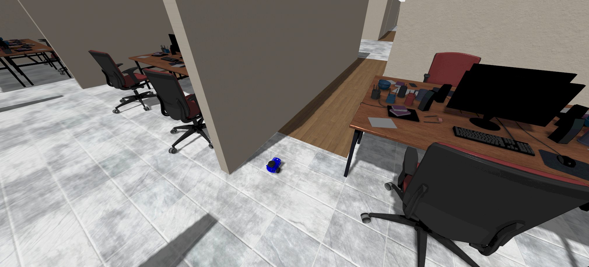

# Andino Hybrid Control Simulation



## :clipboard: Description

This package provides a simulation environment for the [Andino](https://github.com/Ekumen-OS/andino) robot in [Gazebo Fortress](https://gazebosim.org/home), focusing exclusively on **Hybrid Control**. It combines a **Non-linear Controller** (Feedback Linearization) with a **Reinforcement Learning (RL) Disturbance Compensator** (SAC) to achieve robust trajectory tracking even under disturbances.

## :clamp: Platforms

- ROS 2: Humble Hawksbill
- OS:
  - Ubuntu 22.04 Jammy Jellyfish
- Gazebo:
  - Fortress

## :inbox_tray: Installation & Build

### From source

1. Clone this repository (and ensure you have [ROS 2 Humble](https://docs.ros.org/en/humble/Installation.html) installed).
2. Install dependencies:
   ```sh
   rosdep install --from-paths src -i -y
   ```
3. Build the workspace and source it:
   ```sh
   colcon build
   source install/setup.bash
   ```

## :rocket: Usage

### Hybrid Control Pipeline

Once the package is built and sourced, you can start the hybrid control simulation. This launch file brings up Gazebo, the trajectory generator, the nonlinear controller, the RL disturbance compensator, and performance monitoring nodes.

```sh
ros2 launch andino_hybrid_control hybrid_control.launch.py
```

### Launch Arguments

You can customize the simulation behavior using the following optional arguments:

- `rl_enabled`: Enable RL disturbance compensation (`true`) or use pure model-based baseline mode (`false`). Default: `true`.
- `mode`: RL mode (`random` | `online` | `pretrained`). Default: `random`.
- `trajectory_type`: Reference trajectory (`circle` | `figure8` | `lemniscate` | `square`). Default: `circle`.
- `radius`: Trajectory radius or scale [m]. Default: `2.0`.
- `speed`: Tangential speed along trajectory [m/s]. Default: `0.15`.
- `world_name`: Gazebo world to load. Default: `inspection_disturbance.sdf`.
- `enable_logging`: Enable performance data logging to CSV. Default: `true`.

### Usage Examples

**1. Baseline Mode (No RL)**
Run the pure non-linear controller on a figure-8 trajectory:
```sh
ros2 launch andino_hybrid_control hybrid_control.launch.py rl_enabled:=false trajectory_type:=figure8
```

**2. Online RL Training**
Run online SAC training on a square trajectory:
```sh
ros2 launch andino_hybrid_control hybrid_control.launch.py mode:=online trajectory_type:=square
```

**3. Pretrained RL Evaluation**
Evaluate a pretrained RL model on a lemniscate trajectory:
```sh
ros2 launch andino_hybrid_control hybrid_control.launch.py mode:=pretrained trajectory_type:=lemniscate speed:=0.2
```

## :raised_hands: Contributing

Issues or PRs are always welcome! Please refer to the [CONTRIBUTING](CONTRIBUTING.md) doc.

## Code development

Note that a [`docker`](./docker) folder is provided for easy setting up the workspace.
